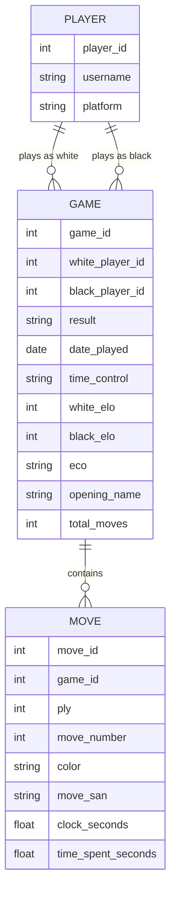

# Final Project Milestone 2
## ER Diagram


## Conceptual Schema
### Entities
#### Players
Any unique user (username) on chess.com (platform) with a unique user id (player_id)

#### Games
Any single game (game_id) played between two players (white_player_id, black_player_id) with other properties like result, date_played, time_control, opening_name, etc.

#### Moves
All the moves contained within a specific game (move_id) with other properties like ply, move_number, color, move_san, clock_seconds, and time_spent_seconds


### Relationships & Cardinalities

#### Players to Games
A player participates in a game as either white or black, identified by player_id. One player can have many games, so the relationship is 1:N. 

#### Games to Moves
A game contains a list of moves. One game can have many moves, so the relationship is 1:N.


## Data Constraints

### Player Table Constraints
- Player_id is a primary key so that every player record can be uniquely identified. This implies uniqueness and not null.
- Username must be unique and not null to prevent the database from duplicating records of the same player and to ensure that every player has a username.
- Platform must be not null to ensure we know where the game was played.
### Game Table Constraints
- Game_id is a primary key that uniquely identifies each recorded game. This implies uniqueness and not null.

- white_player_id and black_player_id must be foreign keys that reference the player_id in the player table because games should only exist in the database if they were played by known players. They also must be not null.

- Result must be not null, as every game has an outcome and statstics would break if this was not available.

- White_elo, black_elo, and total_moves should all be integers to properly perform calculations, while time_control, eco, and opening_name should all be strings to allow for easy searching.

- Date_played should, of course, be a date to ensure time window functionality works as intended.

### Move Table Constraints
- Move_id is a primary key to uniquely identify each individual move within a game, implying uniqueness and not null.

- game_id is a foreign key to link the move to a specific game from the game table, also with a not null costraint.

- while move_id is unique globally, we should use a a composite unique constraint combining game_id with ply (each half move) to ensure that each move is unique within a game and that each game has a unique sequence of moves.

- Ply, move_number, color, and move_san should all be not null.

- Clock_seconds and time_spent_seconds should be floats to allow for decimal values and should be not null.

- color and move_san should be strings, while move_number and ply should be integers.

## Initial Code
### schema.sql:

```sql
-- Players table — one row per unique chess.com username
CREATE TABLE IF NOT EXISTS players (
    player_id   SERIAL PRIMARY KEY,
    username    VARCHAR(100) NOT NULL UNIQUE,
    platform    VARCHAR(20) NOT NULL DEFAULT 'chess.com'
);

-- Games table — one row per game
CREATE TABLE IF NOT EXISTS games (
    game_id             SERIAL PRIMARY KEY,
    white_player_id     INT NOT NULL REFERENCES players(player_id),
    black_player_id     INT NOT NULL REFERENCES players(player_id),
    result              VARCHAR(10) NOT NULL,        -- '1-0', '0-1', '1/2-1/2'
    date_played         DATE,
    time_control        VARCHAR(30),                 -- e.g. '180', '600+2'
    time_class          VARCHAR(20),                 -- bullet, blitz, rapid
    white_elo           INT,
    black_elo           INT,
    eco                 VARCHAR(10),                 -- e.g. 'B34'
    opening_name        VARCHAR(255),
    total_moves         INT,
);

-- Moves table — one row per ply
CREATE TABLE IF NOT EXISTS moves (
    move_id                 SERIAL PRIMARY KEY,
    game_id                 INT NOT NULL REFERENCES games(game_id) ON DELETE CASCADE,
    ply                     INT NOT NULL,              -- 1-indexed half-move number
    move_number             INT NOT NULL,              -- full move number (1, 2, 3...)
    color                   VARCHAR(5) NOT NULL,       -- 'white' or 'black'
    move_san                VARCHAR(10) NOT NULL,      -- e.g. 'Nf3', 'O-O', 'exd5'
    clock_seconds           FLOAT,                     -- remaining clock after this move
    time_spent_seconds      FLOAT,                     -- time consumed on this move
    UNIQUE (game_id, ply)
);

CREATE INDEX IF NOT EXISTS idx_games_white_player  ON games(white_player_id);
CREATE INDEX IF NOT EXISTS idx_games_black_player  ON games(black_player_id);
CREATE INDEX IF NOT EXISTS idx_games_date          ON games(date_played);
CREATE INDEX IF NOT EXISTS idx_games_time_class    ON games(time_class);
CREATE INDEX IF NOT EXISTS idx_moves_game_ply      ON moves(game_id, ply);
CREATE INDEX IF NOT EXISTS idx_moves_game_color    ON moves(game_id, color);
```

## Acknowledgments
### Authorship
Joseph Malone - All

Estimated time: 15 hours

### External Resources
Gemini v3.1 Pro was used to double check the presence of all the high-level requirements for this assignment.

## Appendix

DDL, DML, scripts or ss of script/notebook cells